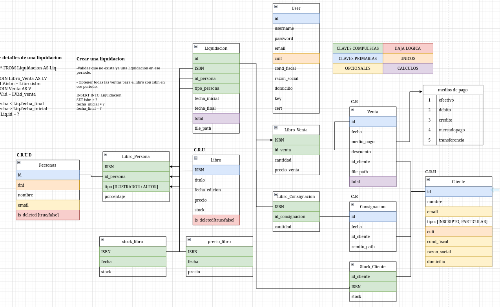

# [Api references](./api.md)

# Estructura de las tablas


# Instalacion con docker
Instalar docker
![Ubuntu] (https://docs.docker.com/engine/install/ubuntu/)

Agregar docker a sudo
`sudo usermod -aG docker $USER`

Buildear los contenedores
`docker compose build`

Correr el servicio
`sudo systemctl start docker`

Ejecutar el server
`docker compose up`

# Instalacion manual

## Instal mylsql ##
`sudo apt install mysql`

## Config mysql ##

Enter in mysql  
`
sudo mysql -u root  
`

Create new user  
`
GRANT ALL PRIVILEGES ON *.* TO 'user'@'localhost' IDENTIFIED BY 'newpassword';
`

## Create new database ##
`
mysql -u user -p
`
`
CREATE DATABASE db_name;
`

## Create the tables ##
Enter in mysql console
Copy /db/db.sql in console and press enter


## Create .env file ##

`
touch .env
`

env file:  
```
DB_HOST: localhost
DB_USER: user  
DB_PASS: passowrd  
DB_PORT: 3306  
DB_NAME: db_name  
DB_PORT: 3000
```

## Run the backend
`npm run dev`
