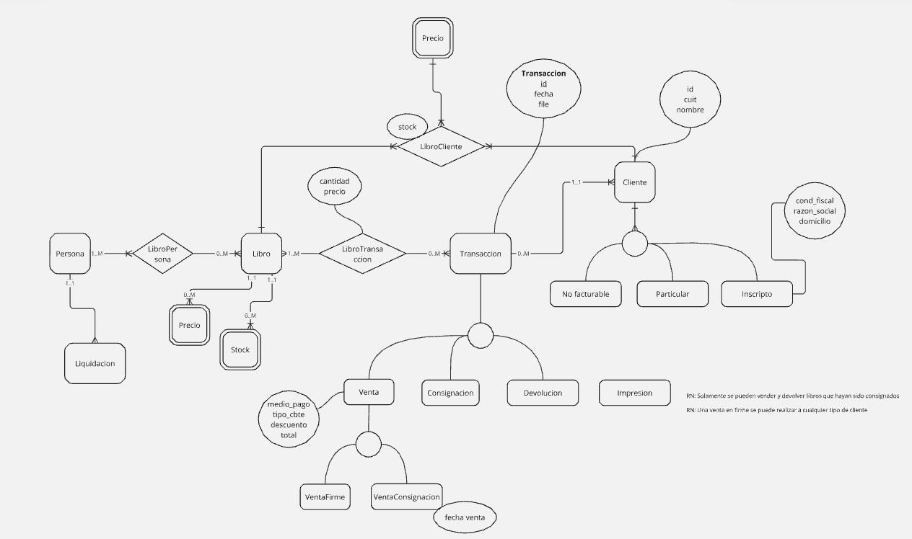

[](https://github.com/Lautarotetamusa/Epublit/actions/workflows/unit-test.yml)

<p align="center">
  <a href="https://epublit.com.ar">
  
  </a>
</p>

# [Epublit](https://epublit.com.ar)
Epublit es un sistema de gestión integral diseñado específicamente para el negocio editorial.

# Diagrama Entidad-Relacion


## Libro
Cada libro tiene un isbn unico, un stock, un titulo, autores e ilustradores. Se guarda un historico de precios.

## Personas
✅
Una persona tiene un dni, un nombre y un email. Una persona puede trabajar como autor, ilustrador o ambas en uno, ninguno o muchos [libro](#libro). Una persona no puede estar dos veces en el mismo libro con el mismo rol. Una persona cobra un porcentaje distinto por cada relacion con un libro en la que se encuentre.

## Liquidacion
⏳Una liquidacion tiene una fecha de inicio y una fecha de fin. Una liquidacion se realiza por autor o ilustrador en un periodo de fechas determinado.
Se calcula el total de [ventas](#venta) realizadas para [libros](#libro) de ese autor o ilustrador en dicho periodo.

## Cliente
✅
Un cliente referencia a una persona que se encuentra en afip, se conoce su cuit, su nombre, condicion fiscal, razon social y domicilio fiscal. Estos ultimos datos deben cargarse automáticamente solo con el cuit. Existen tres tipos de clientes, "inscripto", "particular" y "no facturable".

### Stock cliente
✅
Los clientes inscriptos tienen un stock propio de [libros](#libro), este stock se actualizará cuando se realicen [Consignaciones](#consignacion), [devoluciones](#devolucion) o [ventas de consignaciones](#venta-consignacion).

## Transaccion
✅
Una transaccion tiene muchos [libros](#libro) con una cantidad cada uno y se realiza a un cliente

### Venta
✅
Se emite una factura al menos que sea al [cliente](#cliente) de tipo "no facturable". se conoce tambien una fecha de venta un tipo de comprobante, un medio de pago y un descuento. El descuento se aplica al total de la venta.

### Consignacion
✅
Los libros consignados pasan a estar en el [stock del cliente](#stock-cliente) (librerías). Una consignacion puede ser devuelta o vendida. 

### Devolucion
✅
Los libros que un [cliente](#cliente) tiene en stock pueden ser devueltos, los libros devueltos vuelven a estar en el stock principal. 

### Venta Consignacion
✅
Los libros que un [cliente](#cliente) tiene en stock pueden ser vendidos, se vende al precio que tenian los libros cuando se realizó la [consignación](#consignacion).

## Gastos
⏳
se puede ingresar un gasto, un gasto tiene una fecha un monto y una observación
Balance
El balance representa la diferencia entre los gastos y las entradas (ventas)

# [Api references](./api.md)

# Instalacion con docker
Instalar docker


## The .env file ##
```env
DB_HOST: localhost
DB_USER: user  
DB_PASS: passowrd  
DB_PORT: 3306  
DB_NAME: db_name  
DB_PORT: 3000
```

1. Agregar docker a sudo
```bash
sudo usermod -aG docker $USER`
```

2. Buildear los contenedores
```bash
docker compose build
```

3. Correr el servicio
```bash
sudo systemctl start docker
```

4. Ejecutar el server
```bash
docker compose up
```

# Unit test
1. Levantar la api
```bash
docker compose up -d api
```

2. Correr los tests
```bash
npm run test
```
